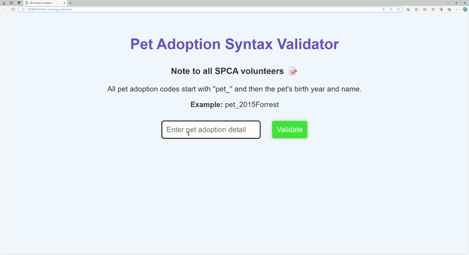

# [JSL01] Submission: Syntax-Engine Interaction Challenge

You will:

1. Use the Starter Code Repo,
2. Code your solution,
3. Commit changes to your repo
4. Submit GitHub Repo Link to LMS [JSL01] Submission Project Tab

Imagine you are building a virtual pet adoption website, and you need to create a JavaScript function that checks if the user has entered valid pet adoption details. Write a function that takes a string as input and validates if it follows a specific syntax, such as starting with "pet\_" followed by a combination of letters and numbers. If the input follows the syntax, return "Valid Syntax," otherwise, return "Invalid Syntax."

## Challenge Instructions

1. In the script.js file, complete the validateSyntax function to check if the input string starts with "pet\_" and is followed by a combination of letters and numbers.
2. If the input follows the correct syntax, set result to "Valid Syntax." Otherwise, set it to "Invalid Syntax."
3. Test your function by entering different strings in the input box and clicking the validate button.

## How to Test

- Run the index.html challenge in a browser.
- Enter different pet adoption details in the input box and click the validate button to see the results.
- Make sure your solution works for a variety of inputs.
- Open the console and debug your code until there are no errors.

## Instructions for Running the Code

1. Save the HTML, CSS, and JavaScript files in a folder.
2. Open the folder in VSCode.
3. Right-click on index.html and open with a browser (use Live Server if available).
4. Modify the script.js file to correct the syntax errors and save the file.
5. Refresh your browser to view the changes.

This challenge helps students practice basic string manipulation and validation in JavaScript, along with simple DOM manipulation to create an interactive and user-friendly interface.

Check out the practice challenges on Scrimba here: https://scrimba.com/playlist/pqPae6ZH7

# Project Overview

- I was given a task to write a function that takes a string as input and validates if it follows a specific syntax, starting with "pet\_" followed by a combination of letters and numbers. If the input follows the syntax, I must be able to make it return "Valid Syntax"; otherwise, return "Invalid Syntax". I had to modify the script.js file I was given to correct the syntax errors and save the file. I used JavaScript.

# Elements Included

- JavaScript modification that validates pet adoption details syntax
- GitHub repository that contains the updated code file.

## Reflections

# Areas of Mastery

- Unfortunately, in this project, there weren't any areas of mastery.

# Challenges Faced

- I faced a challenge of finding the correct solution to code to validate the pet adoption syntax as per the task/project instructions.

# Areas for Improvement

- Understanding syntax clearly and using the "IF" and "ELSE" keywords to build conditional statements.

### Overall Learning Experience

- The project was a bit challenging when I took a look at it, but as I read through my LMS content, I got an idea of what to do. I saw that understanding JavaScript fundamentals is crucial as it forms the building blocks for more advanced concepts. I also need to grasp the concept of validation and why it's important in web development. I found regular expressions really interesting. Overall, this project opened up my mind a bit.
